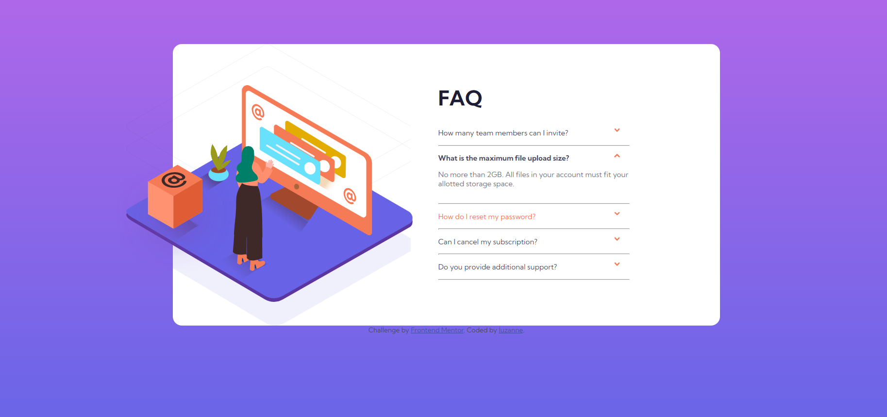

# Frontend Mentor - FAQ accordion card solution

This is a solution to the [FAQ accordion card challenge on Frontend Mentor](https://www.frontendmentor.io/challenges/faq-accordion-card-XlyjD0Oam). Frontend Mentor challenges help you improve your coding skills by building realistic projects. 

## Table of contents

  - [The challenge](#the-challenge)
  - [Screenshot](#screenshot)
  - [Links](#links)
  - [My process](#my-process)
  - [Built with](#built-with)
  - [Continued development](#continued-development)
  - [Useful resources](#useful-resources)
  - [Author](#author)

### The challenge

Users should be able to:

- View the optimal layout for the component depending on their device's screen size
- See hover states for all interactive elements on the page
- Hide/Show the answer to a question when the question is clicked

### Screenshot

### Links

- Solution URL: [Add solution URL here](https://github.com/Luzanne-S/FAQ-Accordian-)
- Live Site URL: [Add live site URL here](https://luzanne-s.github.io/FAQ-Accordian-/)

## My process
Started with the desktop html layout, then created a css file and added styling, once the styling was complete I created media queries to make the page responsive to a mobile device with the width of 375px.
 
### Built with

- Semantic HTML5 markup
- CSS custom properties
- Flexbox

### Continued development

I will continue to attempt using pure css without any frameworks and trying out new techniques.

### Useful resources

-  Google Search
-  Stack Overflow
-  W3 School

## Author

- Frontend Mentor - [@Luzanne-S](https://www.frontendmentor.io/profile/Luzanne-S)

